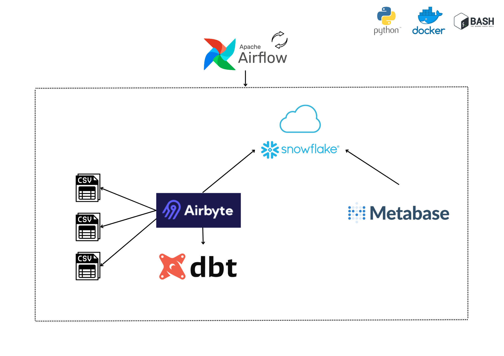

# Projeto de Engenharia de Dados | Epidemia Mundial
> A fim de diversificar os conhecimentos com diferentes ferramentas para Engenharia de Dados, neste projeto reescrevo seu propósito, criando uma operação para trabalhar em bacth integrada ao novo Data Warehouse dedicad.

### Arquitetura

